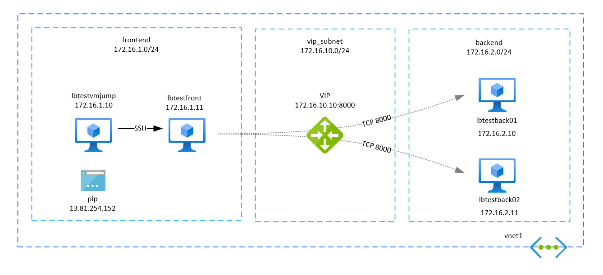

# Internal Load Balancer

## Overview

This a simple scenario with the internal load balanced publishing services between different service tiers. 

## Steps to reproduce

Rename the terraform.tfvars.git to terraform.tfvars and update the subscription ID in it.

## Load balancer DNAT(configured by Terraform)

|                 Stage                 |Source IP      |Source Port|Destination IP |Destination Port   |
|---------------------------------------|---------------|-----------|---------------|-------------------|
|Traffic sent from frontend VM to VIP   |172.16.1.10    |12345      |172.16.10.10   |8000               |
|Traffic delivered to backend VM        |172.16.1.10    |12345      |172.16.2.10    |8000               |
|Traffic sent from backend VM           |172.16.2.10    |8000       |172.16.1.10    |12345              |
|Traffic received by frontend VM        |172.16.10.10   |8000       |172.16.1.10    |12345              |

Inbound traffic to VIP will go through Destination NAT (or DNAT), meaning that when the traffic hits your VM behind the LB, the destination IP will be that of the VM and not the VIP as in the original packet. The source IP will still be the client’s source IP as expected.
As a piece of evidence see the captured traffic in *.pcap files.
The load balancer created by terraform templates from this repository uses this mode.

## DSR or floating IP (not configured by Terraform)

Direct Server Return (DSR) or floating IP is a feature of the load balancer that disables DNAT.
This means that the traffic hitting your backend VMs will have in its IP headers the VIP (or ILB IP for internal load balancers) as destination IP address.
The backend servers must be configured with the secondary IP address or cluster IP or loopback IP to accept traffic received with the destination address of the VIP.  

|                 Stage                 |Source IP      |Source Port|Destination IP |Destination Port   |
|---------------------------------------|---------------|-----------|---------------|-------------------|
|Traffic sent from frontend VM to VIP   |172.16.1.10    |12345      |172.16.10.10   |8000               |
|Traffic delivered to backend VM        |172.16.1.10    |12345      |172.16.10.10   |8000               |

DSR modifies the traffic flow by permitting the server to respond directly to the client
The VM behind the load balancer will respond to incoming requests without going through LB in front of it.
As traffic doesn't need to travel the load balancer DSR lowers the risk of the load balancer acting as a bottleneck. 
DSR was identified as being an ideal way to handle UDP applications that deliver streaming of audio or video content through RTSP.

## Test LB rules

The function can be tested by executing the scripts calling the endpoint exposed on the VIP or directly on the backend servers.

