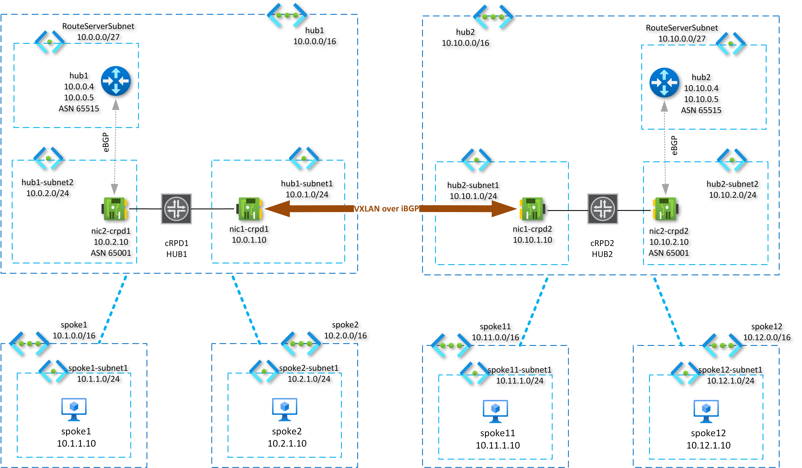

# Multi-region design with Azure Route Server and NVA

The repository contains code to get the infrastructure from the picture below created in Azure. It represents a multi-region design that consists of two hub and spoke elements deployed in different regions.
This simulation is stretched only across one region, however, it might be split into two regions without affecting the functionality.
As network appliances two instances of Juniper Networks cRPD have been used running in Ubuntu virtual machine enabling the VXLAN overlay that is necessary to overcome the routing issues you would end up with if the tunneling mechanism wasn't used.
More information on the loop and the cause why it is created can be found in the article [Route Server Multi-Region Design]( https://blog.cloudtrooper.net/2021/03/06/route-server-multi-region-design/).

In a nutshell, the necessity of using an overlay to route traffic between HUBs comes out from the fact that routes programmed to the subnets in the HUB vnet by respective ARS are learned from the NVA and use its IP address the next-hop. In case of not using an overlay it woudl look like this, if for instance the subnet1 in hub1 receives a packet destined to spoke11 it will be routed according to the route 10.11.0.0/16 that points back to NVA. In other words routing loop is created.
This behaviour can be changed with implementing overlay though. Then the packets will be encapsulated into the VXLAN and sent over to remote NVA's address though vnet peering. 



To make the setup with VXLAN over BGP work on cRPD the routing instance has to be created occupying one of the NICs (eth1). The other one eth0 is used for remote access and for overlay transport.
Teh loopback interface is one more thing has to be configured to make VXLAN over BGP work. It serves as tunnel endpoint and its IP address is used as source address in outer VXLAN header.

HUB1 - 10.1.100.100/32
```shell
09:56:25.861832 IP 10.1.100.100.51513 > 10.10.1.10.4789: VXLAN, flags [I] (0x08), vni 10001
IP 10.2.1.10 > 10.12.1.10: ICMP echo request, id 31786, seq 2, length 64
```

HUB2 - 10.10.100.100/32
```shell
09:56:24.863708 IP 10.10.100.100.42964 > 10.0.1.10.4789: VXLAN, flags [I] (0x08), vni 10001
IP 10.12.1.10 > 10.2.1.10: ICMP echo reply, id 31786, seq 1, length 64
```


## Provisioning of resources with Terraform

At the time of writing the route server can't be created by Terraform yet. That's why the bicep templates have to come to play.
The vnet peering between hubs and spokes is configured without the option to use remote gateways as the route server doesn't exist yet and the provisioning would end up with an error.
Either deploy the ARS first or create vnet peering without using remote gateways and update it later when both ARS already exist. 

## Configure cRPD

Configuration files can be found in the folder [cRPD](/tf_azure_routeserver_cRPD/cRPD)

Access the terminal and configure the virtual router.

```shell
docker exec -it crpd01 cli
```
Don't forget to apply the trial license to make BGP work. It can be downloaded from cRPD trial pages.

## Create Route servers with Bicep

Get the ARS created by az cli.
```shell
az deployment group create --resource-group rg-nemedpet-routeserver --template-file ars.bicep --parameters hub1.params.json
az deployment group create --resource-group rg-nemedpet-routeserver --template-file ars.bicep --parameters hub2.params.json
```
Note, the branch-to-branch traffic doesn't need to be enabled as the ARS does not have BGP sessions established with multiple peers.   

## Fix vnet peering in Terraform

Swap the config in [azure-peering.tf](/tf_azure_routeserver_cRPD/azure-peering.tf)

```
  use_remote_gateways       = false
  #use_remote_gateways       = true  - hub1 doesn't have ARS yet resulting in an error
```

to

```
  #use_remote_gateways       = false
  use_remote_gateways       = true
```

and run Terraform again. 

## Test connectivity

Watch the YT video demonstrating both the inter-hub and intra-hub connectivity.

[](https://www.youtube.com/watch?v=7YUvr-FvsGE&ab_channel=Germanium)

## Check routes

### Routes received by ARS - HUB1
                                    
```powershell
Get-AzRouteServerPeerLearnedRoute `
-ResourceGroupName rg-nemedpet-routeserver `
-RouteServerName hub1 `
-PeerName cRPD | Format-Table
```

Expected output
```powershell
LocalAddress Network      NextHop   SourcePeer Origin AsPath Weight
------------ -------      -------   ---------- ------ ------ ------
10.0.0.4     10.1.0.0/16  10.0.2.10 10.0.2.10  EBgp   65001   32768
10.0.0.4     10.12.0.0/14 10.0.2.10 10.0.2.10  EBgp   65001   32768
10.0.0.4     10.2.0.0/16  10.0.2.10 10.0.2.10  EBgp   65001   32768
10.0.0.4     10.12.0.0/16 10.0.2.10 10.0.2.10  EBgp   65001   32768
10.0.0.4     10.11.0.0/16 10.0.2.10 10.0.2.10  EBgp   65001   32768
10.0.0.4     10.0.0.0/14  10.0.2.10 10.0.2.10  EBgp   65001   32768
10.0.0.4     10.8.0.0/14  10.0.2.10 10.0.2.10  EBgp   65001   32768
10.0.0.5     10.1.0.0/16  10.0.2.10 10.0.2.10  EBgp   65001   32768
10.0.0.5     10.12.0.0/14 10.0.2.10 10.0.2.10  EBgp   65001   32768
10.0.0.5     10.2.0.0/16  10.0.2.10 10.0.2.10  EBgp   65001   32768
10.0.0.5     10.12.0.0/16 10.0.2.10 10.0.2.10  EBgp   65001   32768
10.0.0.5     10.11.0.0/16 10.0.2.10 10.0.2.10  EBgp   65001   32768
10.0.0.5     10.0.0.0/14  10.0.2.10 10.0.2.10  EBgp   65001   32768
10.0.0.5     10.8.0.0/14  10.0.2.10 10.0.2.10  EBgp   65001   32768
```

### Routes advertised by ARS - HUB1

Get-AzRouteServerPeerAdvertisedRoute
```powershell
Get-AzRouteServerPeerAdvertisedRoute `
>> -ResourceGroupName rg-nemedpet-routeserver `
>> -RouteServerName hub1 `
>> -PeerName cRPD | Format-Table
```

Expected output, the ARS advertises routes of all peered vnets.

```powershell
LocalAddress Network     NextHop  SourcePeer Origin AsPath Weight
------------ -------     -------  ---------- ------ ------ ------
10.0.0.4     10.2.0.0/16 10.0.0.4            Igp    65515       0
10.0.0.4     10.0.0.0/16 10.0.0.4            Igp    65515       0
10.0.0.4     10.1.0.0/16 10.0.0.4            Igp    65515       0
10.0.0.5     10.2.0.0/16 10.0.0.5            Igp    65515       0
10.0.0.5     10.0.0.0/16 10.0.0.5            Igp    65515       0
10.0.0.5     10.1.0.0/16 10.0.0.5            Igp    65515       0
```

### HUB1 blue.evpn.0 

The routes from the remote cRPD (HUB2) are learned over BGP with the next-hop 10.10.1.10 resolvable in the routing table through vnet peering between hubs.

```shell
root@HUB1> show route table blue.evpn.0

blue.evpn.0: 9 destinations, 9 routes (9 active, 0 holddown, 0 hidden)
+ = Active Route, - = Last Active, * = Both

5:10.0.1.10:1::0::10.0.0.0::14/248
                   *[EVPN/170] 03:12:08
                       Fictitious
5:10.0.1.10:1::0::10.1.0.0::16/248
                   *[EVPN/170] 3d 03:44:51
                       Fictitious
5:10.0.1.10:1::0::10.2.0.0::16/248
                   *[EVPN/170] 3d 03:44:51
                       Fictitious
5:10.0.1.10:1::0::10.0.2.0::24/248
                   *[EVPN/170] 3d 03:44:51
                       Fictitious
5:10.10.1.10:1::0::10.8.0.0::14/248
                   *[BGP/170] 02:48:16, localpref 100, from 10.10.1.10
                      AS path: I, validation-state: unverified
                    >  to 10.0.1.1 via eth0
5:10.10.1.10:1::0::10.12.0.0::14/248
                   *[BGP/170] 02:40:38, localpref 100, from 10.10.1.10
                      AS path: I, validation-state: unverified
                    >  to 10.0.1.1 via eth0
5:10.10.1.10:1::0::10.11.0.0::16/248
                   *[BGP/170] 3d 03:30:19, localpref 100, from 10.10.1.10
                      AS path: I, validation-state: unverified
                    >  to 10.0.1.1 via eth0
5:10.10.1.10:1::0::10.12.0.0::16/248
                   *[BGP/170] 3d 03:30:19, localpref 100, from 10.10.1.10
                      AS path: I, validation-state: unverified
                    >  to 10.0.1.1 via eth0
5:10.10.1.10:1::0::10.10.2.0::24/248
                   *[BGP/170] 3d 03:30:19, localpref 100, from 10.10.1.10
                      AS path: I, validation-state: unverified
                    >  to 10.0.1.1 via eth0
```

### HUB1 - blue.inet.0

All routes regardless of whether refer to local or remote region are installed in the routing instance table.

```shell
root@HUB1> show route table blue.inet.0

blue.inet.0: 13 destinations, 18 routes (12 active, 0 holddown, 6 hidden)
+ = Active Route, - = Last Active, * = Both

10.0.0.0/14        *[Static/5] 03:14:26
                    >  to 10.0.2.1 via eth1
10.0.0.4/32        *[Static/5] 3d 03:53:57
                    >  to 10.0.2.1 via eth1
10.0.0.5/32        *[Static/5] 3d 03:53:57
                    >  to 10.0.2.1 via eth1
10.0.2.0/24        *[Direct/0] 3d 03:53:57
                    >  via eth1
10.0.2.10/32       *[Local/0] 3d 03:53:57
                       Local via eth1
10.1.0.0/16        *[Static/5] 3d 03:53:57
                    >  to 10.0.2.1 via eth1
10.2.0.0/16        *[Static/5] 3d 03:53:57
                    >  to 10.0.2.1 via eth1
10.8.0.0/14        *[EVPN/170] 02:50:34
                    >  to 10.0.1.1 via eth0
10.10.2.0/24       *[EVPN/170] 3d 03:32:37
                    >  to 10.0.1.1 via eth0
10.11.0.0/16       *[EVPN/170] 3d 03:32:37
                    >  to 10.0.1.1 via eth0
10.12.0.0/14       *[EVPN/170] 02:42:56
                    >  to 10.0.1.1 via eth0
10.12.0.0/16       *[EVPN/170] 3d 03:32:37
                    >  to 10.0.1.1 via eth0
```

### Linux VRF routing table

```shell
azureuser@crpd1:~$ ip route show vrf __crpd-vrf1
10.0.0.0/14 via 10.0.2.1 dev eth1 proto 22
10.0.0.4 via 10.0.2.1 dev eth1 proto 22
10.0.0.5 via 10.0.2.1 dev eth1 proto 22
10.0.2.0/24 dev eth1 proto kernel scope link src 10.0.2.10
10.1.0.0/16 via 10.0.2.1 dev eth1 proto 22
10.2.0.0/16 via 10.0.2.1 dev eth1 proto 22
10.8.0.0/14  encap ip id 10001 src 10.1.100.100 dst 10.10.1.10 ttl 255 tos 0 via 10.10.1.10 dev irb proto 22 onlink
10.10.2.0/24  encap ip id 10001 src 10.1.100.100 dst 10.10.1.10 ttl 255 tos 0 via 10.10.1.10 dev irb proto 22 onlink
10.11.0.0/16  encap ip id 10001 src 10.1.100.100 dst 10.10.1.10 ttl 255 tos 0 via 10.10.1.10 dev irb proto 22 onlink
10.12.0.0/16  encap ip id 10001 src 10.1.100.100 dst 10.10.1.10 ttl 255 tos 0 via 10.10.1.10 dev irb proto 22 onlink
10.12.0.0/14  encap ip id 10001 src 10.1.100.100 dst 10.10.1.10 ttl 255 tos 0 via 10.10.1.10 dev irb proto 22 onlink
```


## Software versions

* cRPD
```
root@HUB1> show version
Hostname: HUB1
Model: cRPD
Junos: 21.4R1.12
cRPD package version : 21.4R1.12 built by builder on 2021-12-17 14:48:30 UTC
```
According to the documentation 

https://www.juniper.net/documentation/us/en/software/crpd/crpd-deployment/topics/concept/crpd-supported-features.html

EVPN Type 5 with VXLAN is supported starting in cRPD Release 21.1R1.


* docker
```shell
azureuser@crpd1:~$ docker version
Client: Docker Engine - Community
 Version:           20.10.12
 API version:       1.41
 Go version:        go1.16.12
 Git commit:        e91ed57
 Built:             Mon Dec 13 11:45:27 2021
 OS/Arch:           linux/amd64
 Context:           default
 Experimental:      true

Server: Docker Engine - Community
 Engine:
  Version:          20.10.12
  API version:      1.41 (minimum version 1.12)
  Go version:       go1.16.12
  Git commit:       459d0df
  Built:            Mon Dec 13 11:43:36 2021
  OS/Arch:          linux/amd64
  Experimental:     false
 containerd:
  Version:          1.4.12
  GitCommit:        7b11cfaabd73bb80907dd23182b9347b4245eb5d
 runc:
  Version:          1.0.2
  GitCommit:        v1.0.2-0-g52b36a2
 docker-init:
  Version:          0.19.0
  GitCommit:        de40ad0

```

* Ubuntu
```shell
azureuser@crpd1:~$ lsb_release -a
No LSB modules are available.
Distributor ID: Ubuntu
Description:    Ubuntu 18.04.6 LTS
Release:        18.04
Codename:       bionic
```
